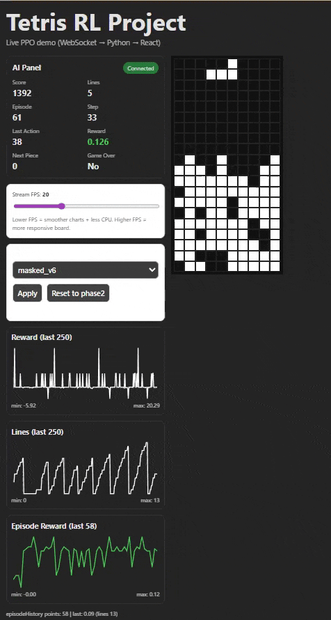

# Tetris RL Project 🎮🤖



A real-time Reinforcement Learning project where a PPO agent learns to play Tetris, visualized live in a React frontend via WebSockets.

The project includes:
- Custom Tetris environment
- PPO + MaskablePPO training
- Live streaming to a web UI
- Model switching during runtime
- CSV logging and analysis tools
- Multiple trained models showing learning progression

🔥 Features
- Live PPO inference streamed to a React frontend
- Model switching in real-time (Phase2 → Phase25 → Masked PPO)
- Adjustable FPS streaming
- CSV logging (steps + episodes)
- Training visualization and run comparison
- Action masking for valid Tetris placements
- Trained models included in repo

### Windows Quick Start
```powershell
.\run_demo.ps1
Then open your browser at:
http://localhost:5173
To stop:
.\stop_demo.ps1

## 🧠 Included Models

| Model Name        | Type           | Avg Lines | Description |
|------------------|---------------|----------|------------|
| phase2           | PPO            | ~3       | Early baseline, simple reward shaping |
| phase25          | PPO            | ~4–5     | Improved reward shaping |
| masked_v5        | MaskablePPO    | ~5–7     | First valid-action constrained model |
| masked_v6        | MaskablePPO    | ~8+      | Final model, clears up to 17 lines |

The project demonstrates how reward shaping and action masking dramatically improve agent performance.  
The masked models avoid invalid placements and converge to significantly stronger gameplay.

Final Model Performance (masked_v6, 200 episodes):

- Avg lines cleared: 8.21  
- Max lines in single game: 17  
- Avg score: 2081  
- Max score: 3780  

Train a model:

python backend/train_ppo.py --timesteps 2000000 --model-out backend/models/my_model

Evaluate:
python backend/eval_ppo.py --model backend/models/my_model --deterministic --episodes 100

## 📂 Project Structure (short)

backend/
  ├─ tetris_rl_env.py
  ├─ train_ppo.py
  ├─ eval_ppo.py
  ├─ watch_ppo_ws.py
frontend/
  ├─ React + Vite app
